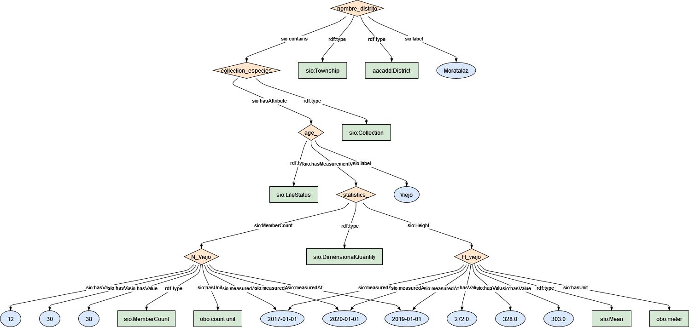

### Semantic model figure

This module describes the data elements related to tree inventory dataset.


<p align="center">
    <a href="../images/arbolado_4.png" target="_blank">
        
    </a>
</p>

***

### Example RDF (turtle):

```ttl

@prefix : <http://purl.org/ejp-rd/cde/v1/example-rdf/> .
@prefix obo: <http://purl.obolibrary.org/obo/> .
@prefix sio: <http://semanticscience.org/resource/> .
@prefix xsd: <http://www.w3.org/2001/XMLSchema#> .
@prefix rdfs: <http://www.w3.org/2000/01/rdf-schema#> .
@prefix dc: <http://purl.org/dc/elements/1.1/> .

:nombre_distrito  a :District, sio:Township ;
    sio:label "Moratalaz"^^xsd:string ;
    sio:contains :collection_especies .

:collection_especies a sio:Collection ;
    sio:hasAttribute :age_ .

:age_ a sio:LifeStatus ;
    sio:label "Viejo"^^xsd:string ;
    sio:hasMeasurementValue :statistics_ .

:statistics_ a sio:DimensionalQuantity ;
    sio:MemberCount :N_Viejo ;
    sio:Height :H_viejo .

:N_Viejo a sio:MemberCount ;
    sio:hasValue "12"^^xsd:integer ,
         "30"^^xsd:integer ,
         "38"^^xsd:integer ;
    sio:hasUnit obo:UO_0000189 ;
    sio:measuredAt "2017-01-01"^^xsd:date,
        "2019-01-01"^^xsd:date,
        "2020-01-01"^^xsd:date .


:H_viejo a sio:Mean ;
    sio:hasValue "272.0"^^xsd:float ,
         "303.0"^^xsd:float ,
         "328.0"^^xsd:float ;
    sio:hasUnit obo:UO_0000008 ; # mts
    sio:measuredAt "2017-01-01"^^xsd:date,
        "2019-01-01"^^xsd:date,
        "2020-01-01"^^xsd:date .

```

***

### Data Description
  
| Original variable name                   | New variable name     | Description                                                  | Type   | Use                            |
| ---------------------------------------- | --------------------- | ------------------------------------------------------------ | ------ | ------------------------------ |
| NOMBRE DISTRITO                          | area_name             | Name of the area/district on which tree is located           | `string` | To locate the park             |
| Num_DISTRITO                             | area_code             | The unique ID name of the park on which tree is located      | `int`    |                                |
| Recién Plantado y no consolidado (RPyNC) | n_ageNew              | Number of trees which age is 1 to 5 years                    | `int`    | Phenology/allometric equations |
| Altura Media (Hmedia)_RRLyNC             | avgTreeHt_New         |                                                              |        |                                |
| Joven (J)                                | n_ageJuvenile         | Num of trees in juvenile stage                               | `int`    |                                |
| Hmedia_J                                 | avgTreeHt_Juvenile    | Average height of all J trees in a Park. Calculated as distance from ground level to three top (m) | `int`    | for growth curve or change     |
| Maduro (M)                               | n_ageAdult            | Num of trees Achieved max. Optimal development               | `int`    |                                |
| Hmedia_M                                 | avgTreeHt_Adult       | Average height of all M trees in a Park. Calculated as distance from ground level to three top | `int`    | for growth curve or change     |
| Viejo (V)                                | n_ageOld              | Num of trees deprecated age stage                            | `int`    |                                |
| HMedia_V                                 | avgTreeHt_Juvenile    | Average height of all J trees in a Park. Calculated as distance from ground level to three top | `int`    | for growth curve or change     |
| Otros                                    | n_others              | Number of trees death and others                             | `int`    |                                |
| Hmedia_O                                 | avgTreeHt_Others      | Average height of all O trees in a Park. Calculated as distance from ground level to three top | `int`    | for growth curve or change     |
| Total General                            | subTotalCountDistrict | Total amount of trees in each district within a city         | `int`    | To count/agg per district      |


### Mapping:
[Python Script](https://github.com/carlosug/opengov-kg/blob/main/etl/generate_rdf4.py)
### Output:
[RDF File](https://github.com/carlosug/opengov-kg/blob/main/etl/outputs/rdflib-output4.ttl)

### CHALLENGES AND TODO:
* Average has cts and mts so python mapping script has function to take it into account.
