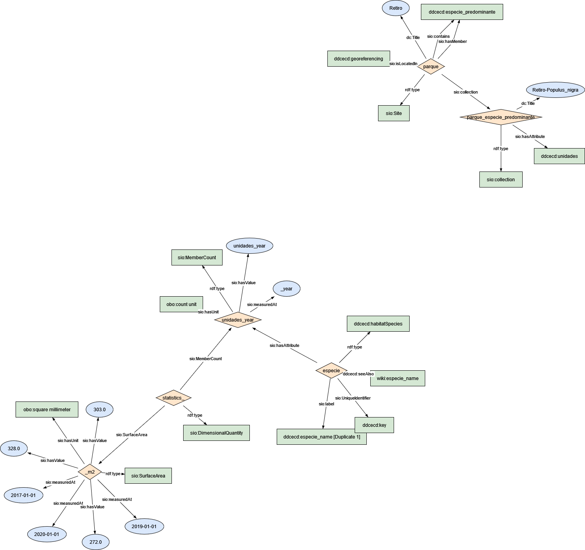

### Semantic model figure

This module describes the data elements related to tree inventory dataset.


<p align="center">
    <a href="../images/arbolado_5.png" target="_blank">
        
    </a>
</p>

***

### Example RDF (turtle):

```ttl

@prefix : <http://purl.org/ejp-rd/cde/v020/example-rdf/> .
@prefix obo: <http://purl.obolibrary.org/obo/> . 
@prefix sio: <http://semanticscience.org/resource/> .
@prefix xsd: <http://www.w3.org/2001/XMLSchema#> .
@prefix dc: <http://purl.org/dc/elements/1.1/> .
@prefix wiki: <http://en.wikipedia.org/wiki/> .

:parque a sio:Site ;
    sio:isLocatedIn :georeferencing ;
    dc:title "Retiro"^^xsd:string ;
    sio:collection  :parque_especie_predominante ;
    sio:contains :especie_predominante ;
    sio:hasMember :especie_predominante .


:parque_especie_predominante a sio:collection ;
    dc:title "Retiro-Populus_nigra"^^xsd:string ;
    sio:hasAttribute :unidades .

:statistics_ a sio:DimensionalQuantity ;
    sio:MemberCount :unidades_year ;
    sio:SurfaceArea :_m2 .

:unidades_year a sio:MemberCount ;
    sio:hasValue "unidades_year"^^xsd:integer ;
    sio:hasUnit obo:UO_0000189 ;
    sio:measuredAt "_year"^^xsd:date .

:_m2 a sio:SurfaceArea ;
    sio:hasValue "272.0"^^xsd:float ,
         "303.0"^^xsd:float ,
         "328.0"^^xsd:float ;
    sio:hasUnit obo:UO_0000082 ; # mts2
    sio:measuredAt "2017-01-01"^^xsd:date,
        "2019-01-01"^^xsd:date,
        "2020-01-01"^^xsd:date .


# <!-- map UniqueIdentifier with WIKI and gbif database -->

:especie a :habitatSpecies ;
    sio:hasAttribute :unidades_year ;
# :especie a sio:Object .
    sio:UniqueIdentifier :key ;
    sio:label :especie_name ;
    :seeAlso wiki:especie_name .

```

***

### Data Description
  
| Original variable name       | New variable name | Description                                                  | Type   | Use                       |
| ---------------------------- | ----------------- | ------------------------------------------------------------ | ------ | ------------------------- |
| PARQUE                       | park_name         | The unique name of the park on which tree is located         | `string` | To locate the tree        |
| ESPECIE PREDOMINANTE         | scientific_name   | Botanical name for the dominant specie                       | `string` | To group by taxon         |
| UNIDADES YEAR                | count             | Number of tree from same type                                | `int`    | To count/sum              |
| Total General                | subTotalCountPark | Total amount of trees in each park within a city             | `int`    | To count/agg per district |
| SUPERFICIE OCUPADA (m2)      | surfaceArea       | Estimated using density of each mass of all trees in each park within a city (m2) | `float`  |                           |
| Superficie (ha)              | surface           | Calculated area equal to a squared 100 m sides (h)           | `float`  |                           |
| Superficie TOTAL Parque (ha) | surfacePark (h)   | Surface of the total park                                    | `float`  |                           |

### Mapping:
[Python Script](https://github.com/carlosug/opengov-kg/blob/main/etl/generate_rdf5.py)
### Output:
[RDF File](https://github.com/carlosug/opengov-kg/blob/main/etl/outputs/rdflib-output5.ttl)

### CHALLENGES AND TODO:
* Remove unnecessary rows as total, num district and aggregate values.
* 2017 has to be converted into csv file.
* All entities uses SIO schema but the issue will be to map each entity with global identifier within biodiversity database (e.g. wikidata API such https://www.wikidata.org/w/api.php?action=wbsearchentities&search=pinus&language=en or https://www.gbif.org/species/2684241).
* Still data has to be cleaned e.g. extra text in some rows, even if character latin has been removed previously.
* Inconsistency file and variable names.
* Georeferencing still has to happen.
* District a Spatial region or Site SIO class.
