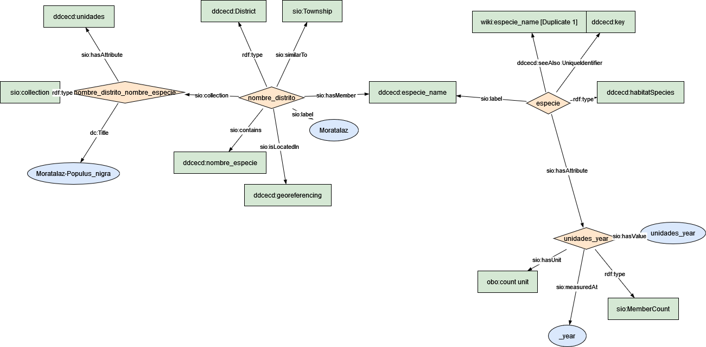

### Semantic model figure

This module describes the data elements related to tree inventory dataset.

<p align="center">
    <a href="../images/arbolado_2.png" target="_blank">
        
    </a>
</p>

***

### Example RDF (turtle):

```ttl

@prefix : <http://purl.org/ejp-rd/cde/v020/example-rdf/> .
@prefix obo: <http://purl.obolibrary.org/obo/> . 
@prefix sio: <http://semanticscience.org/resource/> .
@prefix xsd: <http://www.w3.org/2001/XMLSchema#> .
@prefix dc: <http://purl.org/dc/elements/1.1/> .
@prefix wiki: <http://en.wikipedia.org/wiki/> .

:nombre_distrito a :District ;
    sio:similarTo sio:Township ;
    sio:isLocatedIn :georeferencing ;
    sio:label "Moratalaz"^^xsd:string ;
    sio:contains :nombre_especie ;
    sio:collection  :nombre_distrito_nombre_especie ;
    sio:hasMember :especie_name .

:nombre_distrito_nombre_especie a sio:collection ;
    dc:title "Moratalaz-Populus_nigra"^^xsd:string ;
    sio:hasAttribute :unidades .

:unidades_year a sio:MemberCount ;
    sio:hasValue "unidades_year"^^xsd:integer ;
    sio:hasUnit obo:UO_0000189 ;
    sio:measuredAt "_year"^^xsd:date .


# <!-- map UniqueIdentifier with WIKI and gbif database -->

:especie a :habitatSpecies ;
    sio:hasAttribute :unidades_year ;
# :especie a sio:Object .
    sio:UniqueIdentifier :key ;
    sio:label :especie_name ;
    :seeAlso wiki:especie_name .

```

***

### Data Description


| Original variable name | New variable name     | Description                                                  | Type   | Use                       | SIO Term | Other Term |
| ---------------------- | --------------------- | ------------------------------------------------------------ | ------ | ------------------------- | -------- | ---------  |
| Nombre_distrito        | district_name         | The unique name of the district on which tree is located     | `string` | To locate the tree        | [SpatialRegion](https://vemonet.github.io/semanticscience/browse/class-siospatialregion.html) | |
| Num_distrito           | district_name         | The unique ID number of the district on which tree is located | `string` | No use        | | |
| NOMBRE_ESPECIE         | scientific_name       | Botanical name for the dominant specie                       | `string` | To group by taxon         | [MaterialEntity](https://vemonet.github.io/semanticscience/browse/class-siomaterialentity.html) | Specie |
| UNIDADES YEAR          | count                 | Number of tree from same type                                | `int`    | To count/sum              |[MemberCount](https://vemonet.github.io/semanticscience/browse/class-siomembercount.html)|
| Total                  | subTotalCountDistrict | Total amount of tree in each district within a city          | `int`    | No use | | |


### Mapping:
[Python Script](https://github.com/carlosug/opengov-kg/blob/main/etl/generate_rdf2.py)
### Output:
[RDF File](https://github.com/carlosug/opengov-kg/blob/main/etl/outputs/rdflib-output2.ttl)

### CHALLENGES AND TODO
* Remove unnecessary rows as total, num district and aggregate values.
* 2017 has to be converted into csv file.
* All entities uses SIO schema but the issue will be to map each entity with global identifier within biodiversity database (e.g. wikidata API such https://www.wikidata.org/w/api.php?action=wbsearchentities&search=pinus&language=en or https://www.gbif.org/species/2684241).
* Still data has to be cleaned e.g. extra text in some rows, even if character latin has been removed previously.
* Inconsistency file and variable names.
* Georeferencing still has to happen.
* District a Spatial region or Site SIO class.
