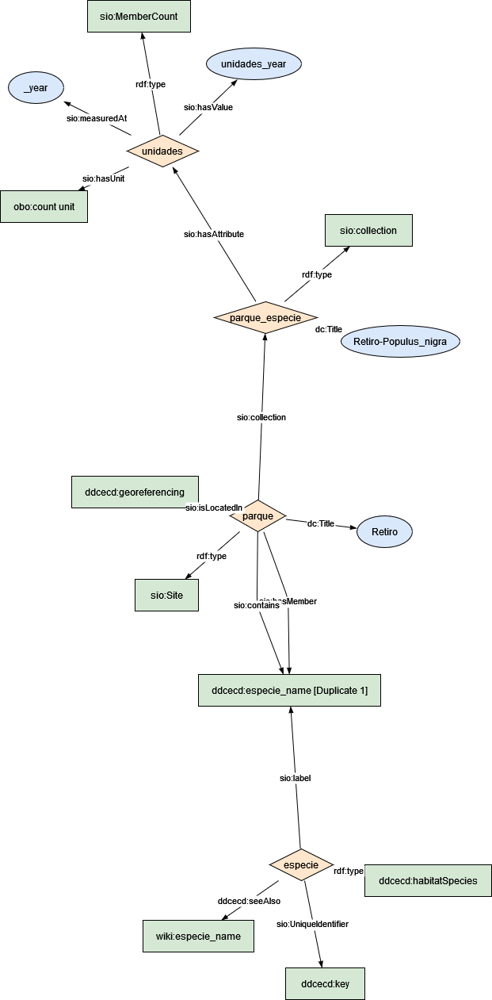

### Semantic model figure

This module describes the data elements related to tree inventiry stored in a biobank

<p align="center">
    <a href="../images/arbolado_1.png" target="_blank">
        
    </a>
</p>

***

### Example RDF (turtle):

```ttl

@prefix : <http://purl.org/ejp-rd/cde/v020/example-rdf/> .
@prefix obo: <http://purl.obolibrary.org/obo/> . 
@prefix sio: <http://semanticscience.org/resource/> .
@prefix xsd: <http://www.w3.org/2001/XMLSchema#> .
@prefix dc: <http://purl.org/dc/elements/1.1/> .
@prefix wiki: <http://en.wikipedia.org/wiki/> .

:parque_name a sio:Site ;
    sio:isLocatedIn :parque_name ;
    dc:title "Retiro"^^xsd:string ;
    sio:collection  :parque_name_especie_names ;
    sio:contains :especie_name ;
    sio:hasMember :especie_name .

:parque_name_especie_names a sio:collection ;
    dc:title "Retiro-Populus_nigra"^^xsd:string ;
    sio:hasAttribute :unidades .

:unidades a sio:MemberCount ;
    sio:hasValue "unidades_year"^^xsd:integer ;
    sio:hasUnit obo:UO_0000189 ;
    sio:measuredAt "_year"^^xsd:date .


# <!-- map UniqueIdentifier with WIKI and gbif database -->

:especie a :habitatSpecies ;
# :especie a sio:Object .
    sio:UniqueIdentifier :key ;
    sio:label :especie_name ;
    :seeAlso wiki:especie_name .

```

***

### Data Description
    
  
| Original variable name           | New variable name | Description                                                  | Type   | Use                            | SIO Term | Other Term |
| -------------------------------- | ----------------- | ------------------------------------------------------------ | ------ | ------------------------------ | ------- | ---------- |
| PARQUE                           | park_name         | The unique name of the park on which tree is located         | ``string`` | To locate the tree             |   |  |
| Altura Promedio (m)              | avgTreeHt         | Average height (m) of all trees in a Park. Calculated as distance from ground level to three top | `int`    | for growth curve or change     | | |
| Perimetro Promedio (cm)          | avgTreePerim      | Average circumference of all trees in a Park. Diameter * Pi  | ``int``    | Phenology/allometric equations | | |
| Recién Plantado y no consolidado | n_ageNew          | Number of trees which age is 1 to 5 years                    | ``int``    | Phenology/allometric equations | | |
| Joven                            | n_ageJuvenile     | Num of trees in juvenile stage                               | `int`    |                                | | |
| Maduro                           | n_ageAdult        | Num of trees Achieved max. Optimal development               | `int`    |                                | | |
| Viejo                            | n_ageOld          | Num of trees deprecated age stage                            | `int`    |                                | | |
| Otros                            | n_others          | Number of trees death and others                             | `int`    |                                | | |
| Total General                    | subTotalCountPark | Total amount of trees in each park within a city             | `int`    | To count/agg per district      | | |
| Total                            | totalCountPark    | Total amount of tree in all parks within a city              | `int`    | To count/agg the whole city    | | |


### Mapping:
[Python Script](https://github.com/carlosug/opengov-kg/blob/main/etl/generate_rdf2.py)
### Output:
[RDF File](https://github.com/carlosug/opengov-kg/blob/main/etl/outputs/rdflib-output2.ttl)

### CHALLENGES AND TODO:
* Data cleaning: remove latin character and others _(*&(&#))_, unnecessary rows as total and aggregate values. [see data-cleaning.py](https://github.com/carlosug/opengov-kg/blob/main/etl/data-cleaning.py)
* All entities uses SIO schema but **specie** is not clear yet.
* The issue will be to map each entity with global identifier within biodiversity database (e.g. wikidata API such https://www.wikidata.org/w/api.php?action=wbsearchentities&search=pinus&language=en or https://www.gbif.org/species/2684241). [see data-argumentation.py](https://github.com/carlosug/opengov-kg/blob/main/etl/data-argumentation.py)
* Inconsistency file and variable names and therefore harmonization of the entity names.
* **Data Argumentation with georeferencing parks and taxo, family and other related terms from scientificname.** [see unique-species.py](https://github.com/carlosug/opengov-kg/blob/main/etl/unique-species.py)
